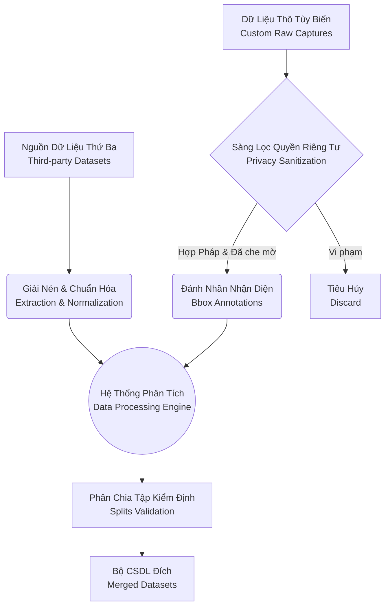

# Cấu Trúc Hệ Tuyến Dữ Liệu (Data Pipeline Architecture)

Tài liệu này định nghĩa cấu trúc quy trình xử lý dữ liệu phục vụ Trợ lý Hỗ trợ Tiếp cận (Accessibility Assistant). Nhằm bảo đảm tính toàn vẹn dư liệu, hệ thống tuân thủ nghiêm ngặt cơ chế Chạy Giả Lập Mặc Định (Default Dry-run Mode) đối với mọi tập lệnh, ngăn chặn hiện tượng tải tràn bộ nhớ hoặc ghi đè phi chủ đích ngoại trừ khi người phân tích quyết định cấu hình quyền thực thi trực tiếp.

## Sơ Đồ Khái Quát Điểu Hướng Dữ Liệu (Data Flow Architect)



## Khảo Khảo Kiến Trúc Thư Mục (Directory Hierarchy)

Dưới đây là sơ khai mô tả các phân ban không gian lưu trữ đối với hạng mục Dữ liệu chuyên biệt.

| Phân Vùng Lưu Trữ (Directory) | Diễn Giải Học Thuật (Academic Description) | Trạng Thái Lưu Trữ Khác (Git Tracking) |
| --- | --- | --- |
| `configs/datasets/` | Khối tệp Cấu hình Khai báo chứa thông số mô hình hóa hệ thống. | Được Tracking |
| `src/training/data/` | Mã nguồn cốt lõi thực thi Quy trình Giải nén và Xử lý. | Được Tracking |
| `src/training/scripts/` | Giao diện điều khiển Dòng lệnh Lõi (CLI Facades) của tiện ích. | Được Tracking |
| `data/downloads/` | Tệp lưu trữ nguyên bản hoặc Nén nguyên khối chưa giải nén. | Git-ignore |
| `data/external/` | Khối dữ liệu bên thứ ba đã qua phân rã thành tệp cục bộ. | Git-ignore |
| `data/custom/raw_frames/` | Ảnh kết xuất trực quan thô từ Trạm quay tùy biến. | Git-ignore |
| `data/custom/sanitized/` | Dữ liệu cá thể hóa đã trừ khử thông tin nhận dạng (PII).| Git-ignore |
| `data/custom/exports/` | Khối tập tin được tải nối tiếp từ hệ quản trị Nhãn Dán (CVAT/Roboflow). | Git-ignore |
| `data/processed/` | Dữ liệu hình thái cuối cùng đã vượt qua thẩm định để Huấn luyện mô hình. | Git-ignore |

> [!NOTE] Phân Cấp Dữ Liệu Thô (Ignored Boundaries)
> Toàn bộ phân vùng thư mục `data/` bắt buộc phải được duy trì chế độ cách ly kiểm soát mã nguồn (`.gitignore`). Nghiêm cấm đưa tập dữ liệu của bên thứ ba, khối ảnh thô chưa phân tách, chuỗi băng ghi âm hoặc trọng số mô hình lên kho mã nguồn (repository).

## Cơ Chế Chạy Giả Lập Mặc Định (Dry-run Fallback Mechanism)

Mọi thao tác có tác động lên Cấu trúc tệp đều yêu cầu lệnh khẳng quyết. Các câu lệnh sau đều vận hành ở chế độ xem trước (preview operations):

```bash
python -m src.training.scripts.data_utils download-plan
python -m src.training.scripts.data_utils verify-dataset-paths --tasks object_detection action_recognition scene_classification
python -m src.training.scripts.data_utils write-classes
python -m src.training.scripts.data_utils build-action-manifest
```

> [!WARNING] Cấp Quyền Điểu Tiến (Execution Authorization)
> Chỉ bổ sung tham số `--execute` vào câu lệnh khi nhà nghiên cứu đã chắc chắn về hiệu năng lưu trữ và tính tuân thủ pháp lý cho luồng thông tin mới được khởi phát.

Trong trường hợp máy chủ của người dùng có nền tảng định danh biến môi trường lỗi (missing Python paths), hãy sử dụng lệnh khởi động phụ trợ (Fallback powershell bindings):

```powershell
$AIN501_PY="$env:USERPROFILE\miniconda3\envs\trungbd\python.exe"
& $AIN501_PY -m src.training.scripts.data_utils verify-dataset-paths ...
```

## Tối ưu hóa Luồng ảnh (Frame-based Optimization)

Trong Phase 0, dự án đã thực hiện một cải tiến quan trọng trong cách xử lý dữ liệu Video dành cho nhận diện hành động (Action Recognition).

- **Vấn đề**: Việc đọc video trực tiếp (on-the-fly decoding) gây nghẽn CPU nghiêm trọng (~100% sử dụng), khiến GPU Intel Arc A770 không thể đạt hiệu suất tối đa (chỉ ~20% utilization).
- **Giải pháp**: Phân rã video thành các chuỗi khung hình JPEG (`preprocess_frames.py`) và sử dụng `FrameClipDataset`.
- **Kết quả**: 
    - CPU usage giảm xuống còn **5-10%**.
    - GPU utilization đạt **~90-95%**.
    - Tốc độ huấn luyện tăng gấp **4-5 lần**.

Mọi dữ liệu khung hình được lưu trữ tại `data/processed/action_accessibility/frames/` và được quản lý qua `manifest_frames.csv`.

## Giai Đoạn Dữ Liệu Tùy Biến Bán Tự Động (Semi-Automated Custom Workflow)

Đối với thao tác tích chập CSDL của nhà phát triển thứ ba, nhà cung cấp hệ thống buộc phải tuân theo lộ trình thiết kế. Cụ thể quy trình xử lý tại máy tính cá nhân cho các chú giải tùy biến như sau:

1. Trích xuất Chuỗi khung hình thô (Raw captures) đưa vào `data/custom/raw_frames_private/`.
2. Kiểm duyệt Đạo đức Dữ liệu (Privacy sanitization): Làm mờ điểm đặc trưng khuôn mặt cá thể và biển kiểm soát giao thông. 
3. Loại bỏ phân mảnh vật tư nhạy cảm.
4. Lựa xuất ngẫu nhiên (Sub-sampling) từ 200-500 ảnh đáp ứng Quy chuẩn đối tượng khuyết tật (Accessibility classes) đưa vào Roboflow/CVAT.
5. Sao xuất (Export) dữ liệu dựa trên tiêu chuẩn Nhãn YOLO gốc.
6. Đồng bộ hóa phân lớp đối chiếu (Canonical classes normalization) thông qua tiện ích Lệnh điều hướng.

## Tiền Đề Cam Kết Bảo Mật Riêng Tư (Privacy Baseline Codec)

> [!CAUTION] Cảnh Báo An Toàn Khu Vực Thu Nhận (Data Acquisition Warning)
> Triển khai khai thác hình ảnh (Image capture) phải bảo tồn tính công cộng. Không xâm phạm không gian tĩnh cá nhân (nhà ở nội khu, đặc khu bảo mật) nếu chưa thụ đắc điều khoản chấp thuận khai triển.

- **Khử Nhận Tạng Tuyệt Đối**: Cắt bỏ biểu mục thông tin hóa đơn thẻ, chi tiết y khoa cá nhân. Dữ liệu giai đoạn chuẩn Phase 0 tập trung khai thác Nhận Diện Vật Thể Công Cộng (Public Accessibility Object Detections), không phục vụ mục đích định danh Con người (Biometrics).
- **Hệ thống theo vết (Traceability Manifest)**: Mỗi nhóm phân nhánh tùy biến cần đính kèm siêu dữ liệu về: Ngày ghi chép (Date), Không gian khảo chiếu (Demographic status), và Đội ngũ xử lý (Reviewers).

## Danh Mục Phân Tích Thực Tiễn (EDA Notebooks Reference)

Chuyên viên phân tích dự án được khuyến khích tương tác chéo nhằm khai phá dữ liệu bằng các Thính phòng sổ tay mã thuật (Notebooks):
- Trực quan Phân bố Lớp & Thông số Cấu trúc YOLO: Xem [0.3_coco_detection_explore.ipynb](file:///d:/workspace/GitHub/ain501/notebooks/0.3_coco_detection_explore.ipynb)
- Lọc Trích Thông số Phân Nhóm Video Hành động: Xem [0.4_action_ucf101_explore.ipynb](file:///d:/workspace/GitHub/ain501/notebooks/0.4_action_ucf101_explore.ipynb)
- Phân tách Thông số Ngôn ngữ Tự Nhiên & Đoạn Hội Thoại Đa Dạng: Xem [0.6_msvd_captioning_explore.ipynb](file:///d:/workspace/GitHub/ain501/notebooks/0.6_msvd_captioning_explore.ipynb)
- Xác thực Tích biên Thông qua Thống Kê Hình Học Khối: Xem [0.7_textocr_explore.ipynb](file:///d:/workspace/GitHub/ain501/notebooks/0.7_textocr_explore.ipynb)
