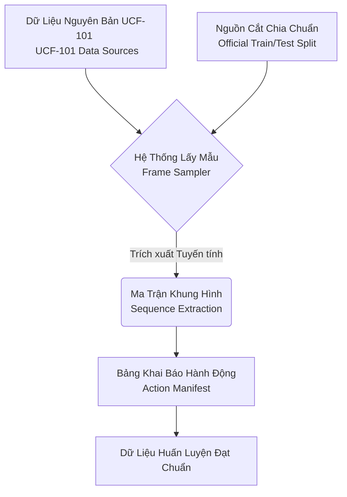

# Bộ Phân Tích Nhận Diện Hành Động (Action Recognition Dataset)

Tác vụ Nhận diện Hành động (Action Recognition) giám sát các chuỗi biến thiên hình chiếu (frame sequences) theo thời gian, nhằm giải quyết nghiệp vụ nhận biết và cảnh báo mẫu hành vi nguy hiểm đối với người khiếm khuyết.

## Sơ Đồ Cấu Trúc Khối Hệ Thống (Structural Flow Diagram)



## Các Thiết Chế Không Gian Và Tham Số Cốt Lõi (Methodological Parameters)

Mô hình hiện thời triển khai các tham số lấy mẫu (Sampling limits) được định cấu hình tại `configs/datasets/action_accessibility.yaml`. Dựa trên bộ dữ liệu Bootstrap UCF-101.

| Bậc Đo Lường (Metrics) | Cơ Phân Bổ (Parameter) | Chỉ Số Thống Kê (Target Value) | Khảo Cứu Sổ Tay (Ref Notebook) |
| --- | --- | --- | --- |
| Điều Hướng (Task) | `task` | `action_recognition` | N/A |
| Giới Hạn Mẫu (Sequence Length)| `frame_sequence_length`| `16` (Độ dài dải chuỗi hệ thống) | [Notebook 0.4](file:///d:/workspace/GitHub/ain501/notebooks/0.4_action_ucf101_explore.ipynb) |
| Cắt Bước (Stride Skip) | `frame_stride` | `2` (Giao thức lướt khung) | [Notebook 0.4](file:///d:/workspace/GitHub/ain501/notebooks/0.4_action_ucf101_explore.ipynb) |
| Lớp Nâng Ngữ Cảnh | `public_bootstrap` | Nhóm 20 Lớp Định hướn Cơ Bản | N/A |
| Lớp Ngoại Lệ Mở Rộng | `custom_required` | Nhóm 8 Lớp Khuyết Thiếu Đợi Khai Thác | N/A |

### Cấu Trúc Hệ Chỉ Phân Ngoại Tầng (Input & Output Vectors)
- Tọa bộ Nguồn Cấp (Input Roots): 
  - Khối CSDL: `data/external/ucf101/UCF-101`.
  - Bộ Tách Tiêu Chuẩn: `data/external/ucf101/ucfTrainTestlist`.
- Tập Đầu Ra Đánh Dấu (Output Manifests): 
  - `data/processed/action_accessibility/manifest.csv`
  - `data/processed/action_accessibility/splits.csv`

## Lộ Trình Phương Pháp Thực Thi (Architectural Implementation)

> [!CAUTION] Cảnh Báo Ghi Đè (Overwriting Precaution)
> Cơ chế mặc định quy ước `--dry-run` nhằm hạn chế ghi đè bảng Phân mảnh (Manifest). Quý chuyên gia chỉ kích hoạt tham số `--execute` sau khi xác thực thành công các tệp UCF nội bộ.

### Giai Đoạn Thẩm Định Mạch Dữ Liệu (Integrity Constraints)
```bash
python -m src.training.scripts.data_utils verify-dataset-paths --tasks action_recognition --skip-downloads
```

### Giai Đoạn Kiến Tạo Bảng Chỉ Mục Hành Động (Action Manifest Contruction)
Hệ thống tiến hành rà quyét siêu đối tượng video và ghim khối đánh nhãn vào `.csv`.
```bash
python -m src.training.scripts.data_utils build-action-manifest --execute
```

### Giai Đoạn Thẩm Định Cuối (Validation Mechanism)
```bash
python -m src.training.scripts.data_utils validate-video-manifest --manifest-csv data/processed/action_accessibility/manifest.csv
```

## Báo Cáo Ngoại Lệ Kỹ Thuật (Risk Diagnosis & Resolution)

> [!WARNING] Lỗi Ngoại Lệ Thường Gặp (Common Defect Origins)
> - **Ngắt Mạch Do Sai Khớp Danh Pháp (Misaligned Root):** Định danh thư mục sai hoặc thiếu hụt danh mục `ucfTrainTestlist` dẫn đến biểu định tuyến thất bại (split mapping crash).
> - **Lệch Lạc Thông Cáo Lớp (Class Canonical Divergence):** Cấu trúc tên thư mục nguồn (class sub-folders) không đồng dạng hóa với dữ liệu chỉ dẫn yaml. Cần tinh chỉnh bộ điều chế tĩnh (Manifest configurations). 

## Tham Biến Kho Lưu Trữ Khoa Học (Notebook Referencing)

> [!NOTE]  
> Toàn bộ logic định tuyến và phác thảo hình học không gian lấy mẫu khung hình được công bố chi tiết tại Khối mã định dạng **[0.4_action_ucf101_explore.ipynb](file:///d:/workspace/GitHub/ain501/notebooks/0.4_action_ucf101_explore.ipynb)**. Vui lòng quan sát các Histogram Mật Độ để có chiến thuật chia Stride hợp lý.
