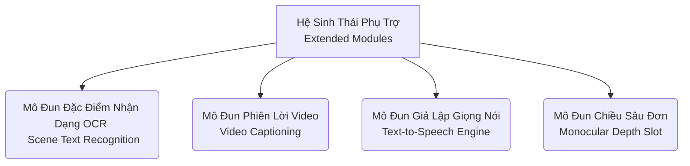

# Ngữ Cảnh Xử Lý Siêu Dữ Liệu Phụ Trợ (Extended Datasets Architecture)

Bản tài liệu này tổng quan hóa các bộ CSDL nằm ngoài trục phát triển lõi (Phase 0 Core block), tuy không tác động trực tiếp đến tiến độ hoàn thành mốc khởi điểm nhưng giữ vai trò nền móng (Foundational placeholders) cho các chu kỳ phát triển nâng cao tính năng nội hệ.

## Lược Đồ Tương Quan Khối Dự Phòng (Deferred Modules Topology)



## 1. Mô Đun Trích Lọc Hình Thái Chữ (OCR Scene Text)

Khai thác năng lực phân tích khung văn bản từ tệp TextOCR.

| Chỉ Báo Thông Số (Metrics) | Tham Biến (Variable) | Hoán Trị Đầu Ra (Output Target) | Khảo Cứu Sổ Tay (Ref Notebook) |
| --- | --- | --- | --- |
| Lớp Căn Bản (Metadata) | `task` | `ocr_scene_text` | N/A |
| Phiên Bản Gốc (Source) | `annotation_version` | `0.1` | N/A |
| Điểm Hội Tụ (Output Root) | `normalized_output`| `data/processed/ocr_textocr/annotations.jsonl` | [Notebook 0.7](file:///d:/workspace/GitHub/ain501/notebooks/0.7_textocr_explore.ipynb) |

> [!WARNING] Thuật Toán Phân Rã Không Gian OCR (OCR Space Omissions)
> Bố cục kỹ thuật yêu cầu hệ thống lược bỏ vĩnh viễn (Permament discard) các chú thích thuộc định dạng `empty_text` và `illegible` để đảm bảo nồng độ tín hiệu cao (high signal-to-noise ratio). 

## 2. Mô Đun Trình Biên Giới Thiệu Chuyển Động (Video Captioning)

Kết xuất siêu ngữ nghĩa diễn đạt chuỗi khung hình từ hệ thống MSVD.

| Chỉ Báo Thông Số (Metrics) | Tham Biến (Variable) | Hoán Trị Đầu Ra (Output Target) | Khảo Cứu Sổ Tay (Ref Notebook) |
| --- | --- | --- | --- |
| Lớp Căn Bản (Metadata) | `task` | `video_captioning` | N/A |
| Giao Diện Khớp Lệnh (Mapping) | `normalized_mapping` | `video_id -> captions[]` | [Notebook 0.6](file:///d:/workspace/GitHub/ain501/notebooks/0.6_msvd_captioning_explore.ipynb) |
| Kho Phông Chữ (Output Root) | `normalized_output` | `.../video_captioning_msvd/captions.json` | N/A |

## 3. Khâu Validation Lõi Tổng Hợp Tiếng Nói (TTS Generation Validation)

Bảo đảm tương quan đồng bộ cho thư viện động cơ (Piper Engine) đối đáp thông tin văn bản sang dạng sóng ngữ thanh (Wav representations). Băng thông mặc định tại mức `22050 Hz`.

```bash
python -m src.training.scripts.data_utils validate-tts --dry-run
```

> [!NOTE] Cấu Trúc Khối Fallback (Fallback Voice Mechanism)
> Hệ thống thiết đặt chéo cơ chế tương quan bổ trợ, khi giọng chuẩn `vi_VN-vais1000-medium` bị khuyết, engine lập tức rớt về phân mảnh thay thế `vi_VN-vivos-x_low`. (Tra cứu nguyên lý hoạt động tại sổ tay [0.8_tts_piper_validation.ipynb](file:///d:/workspace/GitHub/ain501/notebooks/0.8_tts_piper_validation.ipynb))

## 4. Slots Tích Hợp Chiều Sâu Phân Cảnh (Depth Estimation Reserves)

- Mục tiêu: Ánh xạ ảnh ma trận tương khắc RGB (RGB array) kết xuất tỷ lượng phân khúc khoảng cách (distance gradient/depth map).
- Module: MiDaS/DPT.
- Tài liệu sổ tay: Khảo cấu luồng dữ liệu ảo tham chiếu qua [0.9_depth_midas_reserved.ipynb](file:///d:/workspace/GitHub/ain501/notebooks/0.9_depth_midas_reserved.ipynb).

---
*Tất cả thông tin phía trên đều đáp ứng tiêu chí vô hình (Dry-run by default). Không cam kết đưa trọng số đo khoảng cách vật lý (metric scaling parameters) vào không gian Phase 0.*
