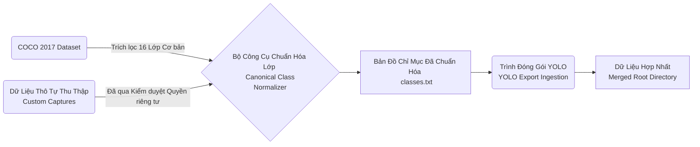

# Bộ Dữ Liệu Phát Hiện Đối Tượng (Object Detection Dataset)

Tác vụ Trích lọc Đặc trưng Nhận diện Đối tượng (Object Detection) đóng vai trò là xương sống (core backbone) trong Hệ thống Hỗ trợ Tiếp cận nhằm định hướng chướng ngại vật và cảnh báo vùng an toàn không gian cho đối tượng khiếm khuyết.

## Lược Đồ Tích Hợp Hệ Thống (Structural Integration Workflow)



## Khai Báo Phương Pháp Luận Và Siêu Dữ Liệu (Methodology & Meta-configurations)

Toàn bộ thông số kiến trúc được liên kết thông qua tệp khai báo lõi: `configs/datasets/object_detection_accessibility.yaml`. Do đặc tính giới hạn của máy thụ đắc (Bootstrap Source) từ bộ dữ liệu COCO 2017 nguyên bản, việc mở rộng kho tri thức thông qua hình ảnh tự thu thập là điều bắt buộc.

| Phân Vùng Lớp (Metadata Class) | Hệ Trục Tham Chiếu (Parameters) | Tham Số Giá Trị (Value Target) | Sổ Tay Liên Phân (EDA Ref) |
| --- | --- | --- | --- |
| Trạng Thái Đầu Ra (Output Format) | `bbox_format` | `coco_xywh_pixels` / Thuận YOLO | [Notebook 0.3](file:///d:/workspace/GitHub/ain501/notebooks/0.3_coco_detection_explore.ipynb) |
| Không Gian Cục Bộ (Target Export) | `yolo_root` | `data/processed/object_detection...` | N/A |
| Không Gian Hợp Nhất (Merged Export) | `merged_root`| `data/processed/..._merged` | N/A |
| Phân Mảnh Cơ Sở (Bootstrap Limit) | `coco_subset` | 16 hạng mục đối tượng (16 classes) | [Notebook 0.3](file:///d:/workspace/GitHub/ain501/notebooks/0.3_coco_detection_explore.ipynb) |
| Phân Mảnh Tùy Biến (Custom Capture) | `custom_only` | 6 hạng mục (`door`, `stairs`, `curb`...) | N/A |

## Giai Đoạn Vận Hành Kiến Trúc (Architectural Operations)

Dưới đây đề cập luồng xử lý đồng bộ chuỗi hệ thống (Synchronized Operations).

### 1. Giai Đoạn Chuẩn Hóa Phân Lớp (Class Canonicalization Stage)
Khởi tạo mốc liên chiếu chuẩn xác định tọa độ khung giới hạn dựa trên `classes.txt`.
```bash
python -m src.training.scripts.data_utils write-classes --execute
```

### 2. Giai Đoạn Nội Suy Định Dạng (Dataset Transpilation Stage)
Diễn dịch cú pháp phân bổ không gian JSON (COCO bounding polygons) sang định dạng YOLO mỏ neo (YOLO anchored format).
```bash
python -m src.training.scripts.data_utils convert --coco-json data/../instances_train2017.json --image-root data/../train2017 --output-root data/processed/... --classes [...] --split train --execute
```

### 3. Giai Đoạn Sáp Nhập Kho Tùy Biến (Custom Vault Merging)
Đồng dạng hóa nhãn hệ thống trước khi ghép nối vào thân dữ liệu trọng tâm.
```bash
python -m src.training.scripts.data_utils normalize-custom-yolo --export-root data/custom/... --output-root data/custom/..._normalized --classes data/processed/.../classes.txt --source-format ultralytics_yolo --dry-run
python -m src.training.scripts.data_utils merge-yolo --sources data/custom/..._normalized ... --dry-run
```

## Chuẩn Đầu Ra (Acceptance Validations)

- Khảo sát sự tồn tại và tính trọn vẹn của tệp định danh `classes.txt`.
- Hàm `validate` quét báo cáo tỷ lệ chéo tỷ lệ ảnh và viền hộp, xác nhận 100% vắng mặt sai lệch điểm (No missing parity).

> [!CAUTION] Cảnh Báo Sai Sót Lập Trình (Common Errors & Divergence)
> **1. Rủi ro sai lệch định hướng Lớp (Class index drift):** Xảy ra khi ánh xạ tự tiện dữ liệu bên thứ ba mà chưa đi qua module `normalize-custom-yolo`. 
> **2. Mất kiểm soát Kích Thước Giới Hạn (BBox Boundary Explosion):** Sau dịch dạng, phân vùng tọa độ (coordinate polygon) có biểu hiện lấn lướt dải giới hạn phân vị `[0, 1]`. Phải phân tích sửa lỗi tại tầng EDA Notebook trước khi chạy bước Hợp nhất.

## Nhật Ký Nghiên Cứu Mở Rộng (Notebook Integration)

> [!NOTE]  
> Các chuyên gia kỹ thuật vui lòng kiểm dẫn chỉ số và đặc tuyến phân phối tại bảng dữ liệu trực quan: **[0.3_coco_detection_explore.ipynb](file:///d:/workspace/GitHub/ain501/notebooks/0.3_coco_detection_explore.ipynb)**. Bảng dữ liệu hỗ trợ cơ trế trực quan hóa Barplot và Boxplot đa chiều.
