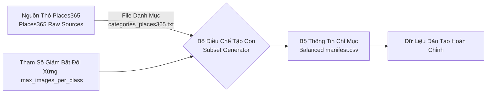

# Bộ Nhận Diện Phân Loại Bối Cảnh (Scene Classification Dataset)

Phân loại Bối cảnh (Scene classification) đảm nhiệm cung cấp hệ quy chiếu môi trường không gian từ đó củng cố độ chính xác cho mô hình nhận diện vật thể lõi của hệ thống.

## Sơ Đồ Khối Tuyến Tính Lọc Phân Nhóm (Topology Filter Diagram)



## Thiết Lập Cấu Hình Và Thông Số Cân Bằng (Balanced Matrix Configurations)

Quá trình điều tiết tài nguyên cho cấu hình bối cảnh tuân thủ biểu mẫu `configs/datasets/scene_accessibility.yaml`. Nhằm kiểm soát hiện tượng bùng nổ không gian lưu trữ (Storage explosion) và Lệch phân phối lớp (Class imbalance), thuật toán sử dụng bộ lọc giới hạn hàm lượng. 

| Không Gian Đo (Category) | Thông Số Kỹ Thuật (Parameter) | Giá Trị Hoạt Động (Target Values) | Liên Kết Sổ Tay (Ref Notebook) |
| --- | --- | --- | --- |
| Lớp Căn Bản (Metadata) | `task` | `scene_classification` | N/A |
| Hệ Thống Lọc (Balancing) | `max_images_per_class` | Khống chế ở mức `1000` | N/A |
| Giới Hạn Hạt Giống (Balancing) | `split_seed` | `501` | N/A |
| Tổ Hợp Phân Lớp (Class Bounds)| `places_subset` | 16 lớp nội tại Places365 | [Notebook 0.5](file:///d:/workspace/GitHub/ain501/notebooks/0.5_places_scene_subset.ipynb) |
| Lớp Proxy Ngoại Lệ (Class Bounds)| `custom_or_proxy` | `sidewalk`, `bus_stop` (Cần nạp ngoài) | [Notebook 0.5](file:///d:/workspace/GitHub/ain501/notebooks/0.5_places_scene_subset.ipynb) |

### Lược Đồ Đầu Vào và Đích Đến (Input/Output Paradigms)
- Cửa Cấp Liệu (Input Roots): 
  - Khối Hình Ảnh Bối Cảnh: `data/external/places365`.
  - Từ Điển Chỉ Mục Lớp: `data/external/places365/categories_places365.txt`.
- Đích Kết Xuất (Output Roots): `data/processed/scene_accessibility` đính kèm Tệp Khai Báo tĩnh `manifest.csv`.

## Các Tuyến Trình Vận Hành Cốt Lõi (Core Methodologies)

> [!WARNING] Cảnh Báo Ghi Đè (Overwriting Incident)
> Luôn giữ tham số `--dry-run` trong những vòng đánh giá ban đầu. Vui lòng quan sát cẩn thận tệp danh mục Categories đầu vào trước khi tiến hành chuyển hóa thành dữ liệu có cấu trúc.

### Giai Đoạn Tính Vẹn Toàn Của Biến Thể (Variant Integrity Assessment)
```bash
python -m src.training.scripts.data_utils verify-dataset-paths --tasks scene_classification --skip-downloads
```

### Giai Đoạn Vận Chuyển Tập Con Có Kiểm Soát (Balanced Subset Generation)
```bash
python -m src.training.scripts.data_utils build-scene-subset --file-list data/external/places365/places365_val.txt --execute
```

## Chỉ Nam Khắc Phục Lỗi Hệ Thống (Diagnostics & Troubleshooting)

> [!CAUTION] Các Lỗi Có Thể Phát Sinh Trong Pipeline (Pipeline Breakdown Factors)
> - **Ngắt Kết Nối Tên Loại (Class ID Disconnection):** Mất tệp `categories_places365.txt` sẽ làm hệ thống không thể dịch định danh chuỗi sang tên lớp văn bản học thuật.
> - **Rỗng Danh Sách Do Thất Lạc Liên Kết (Orphaned File Lists):** Mã lệnh đọc ảnh nguồn khác với gốc thực tế, làm cho tệp `manifest.csv` thiếu vắng giá trị mảng.
> - **Lệch Phân Phối Nhân Sinh (Cost Exploision):** Gỡ bỏ thiết lập giới hạn `max_images_per_class` gây tốn kém thời lượng và không gian phần cứng (I/O Cost).

## Diễn Giải Tham Chiếu Khoa Học (Notebook Referencing)

> [!NOTE]  
> Các quy chuẩn lọc thuật toán Tập Con (Subset Filtering) và phân phối tĩnh theo Tên loại Cảnh Vật (Scene class configurations) được phác họa trong **[0.5_places_scene_subset.ipynb](file:///d:/workspace/GitHub/ain501/notebooks/0.5_places_scene_subset.ipynb)**. Đây là tài liệu kiểm thử không chứa lượng lớn dữ liệu khai báo và an toàn để triển khai cô lập.
