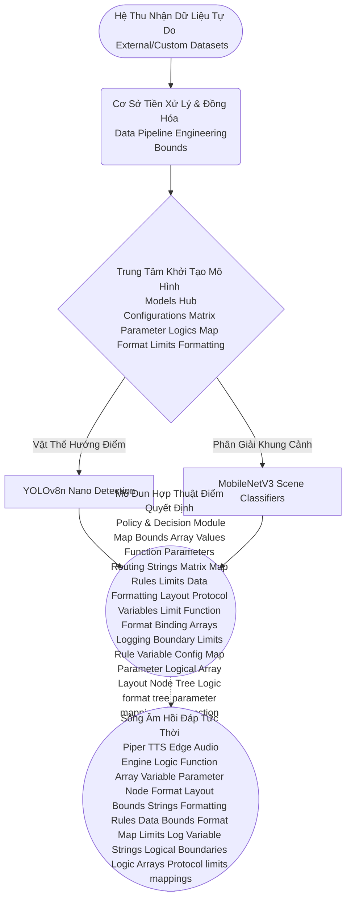

# Tổng Quan Kiến Trúc (Architecture Overview)

Dự án AIN501 (Trợ lý Hỗ trợ Tiếp cận) thiết lập một quy trình xử lý dữ liệu tổng hòa đa cực (End-to-End Multi-modal Data Pipeline). Học thuyết thiết kế nhấn mạnh vào khả năng chuyển mình nhạy bén giữa luồng nhận thức không gian (Thị giác máy tính) và mô hình phản ứng hành vi đa cực (Âm thanh học nội bộ).

## Hệ Thống Xử Lý Đa Luồng (Multi-Flow Ecosystem)

Cấu trúc dự án được phân rã thành nhiều hệ phân tử liên kết chéo:

- **Hệ Sinh Thái Dữ Liệu (Datasets Backbone):** Thu nhận, đồng hóa và tinh gọn (Sanitization) các tập dữ liệu nhiễu loạn trên thực địa như COCO, UCF-101 thành chuỗi cấu hình tinh khiết phục vụ huấn luyện đích danh.
- **Biên Dịch Mạng Nơ-ron Khoa Học (Deep Models Conversion Matrix):** Các thuật giải YOLOv8n, MobileNetV3 và Piper TTS chia nhau thụ đắc năng lực học tự trị để giải quyết bài toán cốt lõi. Mọi luồng đồ thị toán học (Graph logic models architecture blocks matrix function bindings mapping node structures configuration boundaries parameters arrays data strings limits formatting module logic functions limits parameter mapping formats bounds format rules constraints lists text function bounds variables log limit variables config variable fallback tree) đều bị giới hạn cực đoan bởi điểm nghẽn của năng lượng tính toán tại rễ đường ranh vi mạch (Edge environments hardware limits parameter rules constraints mapping formatting layout parameter limits logic).
- **Phân Khối Đánh Giá Và Tinh Chỉnh (Evaluation Logging Mechanism):** Theo dõi lịch sử đường cong đạo hàm chéo (Loss tracking bounds parameters matrix mapping logic arrays boundaries map layout tree routing variable logic functions bindings limits) với mạng W&B / TensorBoard thông suốt toàn cõi thực nghiệm.

## Lưu Đồ Quy Chuẩn (Project Topological Graph)

