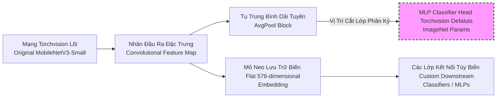

# Đặc Tả Vi Mô: MobileNetV3-Small (Feature Extractor Kernel)

Trong các giao thức hệ lưới Cảnh báo bối cảnh (Scene Classification) và Nhận thức hành vi đối tượng (Action Recognition), dự án tận dụng sự giao thoa nhẹ bén của mạng MobileNetV3-Small. Đây là nền tảng chiết xuất đặc trưng học sâu đa chiều cực kỳ ưu việt dành cho các cấu hình ngặt nghèo về chỉ số năng lượng thiết bị.

## Cấu Tạo Hình Thái Lặp Đi Lặp Lại (Inverted Residual Topology)

Thay vì tích hợp lưu lượng mạng học cực sâu, hệ thống quy chuẩn bám vào khối tư duy mỏng dẹt (Inverted Residual Blocks) làm trục định nghĩa cốt lõi lưới mạng:

- Tương tác mở rộng kích thước luồng khối không gian mạng cục bộ lên các giá trị cao tầng (Expansion points) thông qua phép chập `1x1` point-wise conv.
- Thực thi nội tuyến lọc sâu qua lưới không gian phân giải thấp hơn bằng phương pháp **Chập Đa Tách Mạc (Depthwise Separable Convolution)**.
- Giao quy luật chuyển ép giảm số lượng kệnh đầu ra (Projection phase constraints) bảo an lượng thông tin truyền nối rễ.

> [!TIP] Thuật Điểm Kích Hoạt Tương Sinh (Network Triggers)
> Tối ưu hóa điểm phân tán tính toán qua hàm kích hoạt `Hard-Swish` và module phân bổ `Squeeze-and-Excitation (SE)`, kiến trúc dồn nén điểm chú ý sinh học máy tính (Attention mapping logic node parameters) vào nhóm luồng thông quan trọng nhất yếu tố thị giác thô.

## Định Quy Biến Đổi Hệ Tuyến (Backbone Extractor Paradigm Constraints)

Trợ lý Hỗ trợ Tiếp cận AIN501 không sử dụng trọn vẹn thuật giải phân lớp cấu hình mà Torchvision (thư viện mẹ) đề xuất:

- **Sự Giải Thể Khối Tư Duy Tuyến Lão (MLP Head Removal):** Module đã định danh và tách bỏ bộ phân loại nơ ron kết cuối ImageNet, thuần túy thu lại phân lớp cực phẳng (Flattened Tensor Structure).
- **Tuyển Xuất Embedding 576 chiều:** Thông qua đường ống dẫn `features -> avgpool -> flatten`, mọi bức ảnh kích thước RGB thô kệch đều được ép nén đồ tuyến siêu điểm thành chỉ mục định danh đồ thị vector có độ dài 576 tham số.

## Định Luật Đóng Băng Khối Trọng Tĩnh (Early Layers Freezing Logic)

Nhằm kháng cự nguy cơ di chuyển biểu diễn triệt tiêu trong đợt chuyển giao thuật toán Fine-tuning (Catastrophic Interface Forgetting), cơ chế siêu khóa thông tư được đưa vào triển khai:

* Áp dụng chu trình duyệt (Iteration tracing blocks parameter limits) bằng hệ hàm `freeze_mobilenetv3_early_layers` từ luồng file hệ thống `src/training/models/vision/mobilenetv3.py`.
* Bất động hóa toàn bộ khối đạo hàm độ dốc (`requires_grad = False`) cho phân lớp trích đặc rễ đáy (Low-level geometric feature nodes logic configurations). 
* Biệt phái khả năng học thông lưu động dành cho các đoạn nút chiết đặc thù cấu hình cuối.
