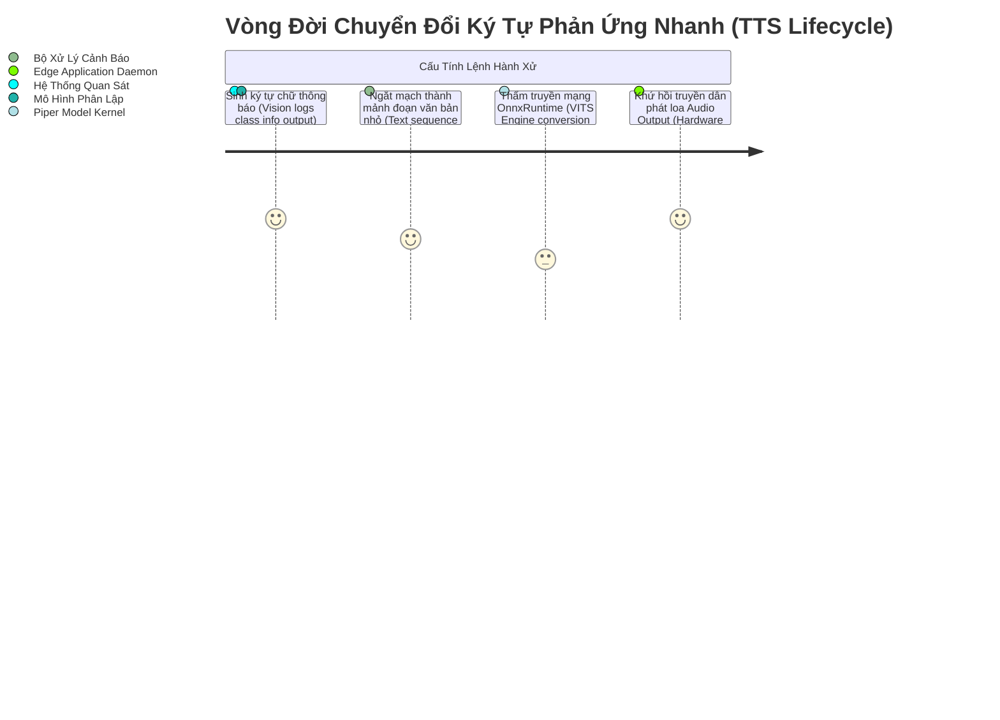

# Kiến Trúc Thanh Âm Hóa Cục Bộ: Piper TTS (Local Text-to-Speech Edge Kernel)

Công nghệ chuyển dải đồ phân giải chuỗi ký tự thành âm thanh học thực diễn dạng sóng (Text-to-Speech) đóng vai trò nòng cốt cuối cùng trong dự án Trợ lý Hỗ trợ Tiếp cận. Mô hình **Piper TTS** tự động trích lọc và nạp năng lượng đồ họa thanh âm nội bộ trên mọi giới hạn cấu hình phần cứng nhỏ nhặt (End-nodes Raspberry Pi / Mobile CPUs).

## Tổng Quan Siêu Cấu Trúc Độc Lập (Stand-alone TTS Protocol)

Trái với nhiều học thuyết cấu trúc thanh âm phân tán ngoại vi mạng nhện máy tính, thuật hệ Piper vương vượng thiết lập đường truyền nội hàm không cần mạng không dây hỗ trợ (Fully Offline Neural Model structure):

- **Siêu Tham Số Lõi Phân Luồng (VITS Topology):** Kế thừa mạng nơ-ron tổng quy dạng kiến trúc tạo sinh khuyếch đại biên cấu rễ (Generative flow model network parameters integration graph logic bounds). Biến dạng giọng thô kệch thành luồng sóng chuẩn đơn âm tự nhiên.
- **Tiến Trình Chống Ngắt Phân Rã Độ Trễ (Low-latency Synthesizing Mapping):** Rải đồ phản ứng chuỗi chớp nhoáng (Real-time tracking response matrix), cho luồng định âm bắt đầu kêu réo gần như tức thời khi đoạn văn bản rễ gốc vừa được điền nắn mảng chuỗi mã cấu `string text` thô sơ xong.



> [!CAUTION] Giới Hạn Cấu Âm Tiết Điệu Hệ Phổ Âm Truyền Đạt
> Mọi hệ tham số trọng số phân luồng giọng nói đều bị rào giới khắt khe trong phổ tần `22050Hz Mono`. Đây là thông số đánh đổi siêu vi tính toán (Computational trade-off metric limits) tuyệt hảo giữa tính trong trẻo âm lực ngôn giao và điểm nhạy cảm tiêu hao đa vi điện năng thiết bị rễ cấu trúc cuối biên.

## Week 5 verification (Piper + baselines)

**Voice paths:** `configs/datasets/tts_piper_accessibility.yaml` uses `voices_root: models/tts/piper` and per-voice `model_path` / `config_path` under that tree. See `models/tts/README.md` if migrating from `models/voices/piper`.

**Sample utterances:** `data/prebuilt_week5/tts_utterances.json` (20 vi/en strings).

**CLI:**

```text
python -m src.training.scripts.data_utils validate-tts --config configs/datasets/tts_piper_accessibility.yaml --execute
python -m src.training.scripts.verify_prebuilt_week5 tts
```

**Outputs:**

- `reports/prebuilt_week5/tts_compare.md` — Piper vs Kokoro vs pyttsx3 (quality, latency, offline, license, Windows notes).
- `reports/prebuilt_week5/piper_benchmark_cpu.json` — per-utterance timings, WAV paths under `data/tts_validation/week5/`, interrupt behavior notes.

**Synthesis:** `src.training.data.tts.piper.synthesize_with_piper` shells out to the `piper` CLI (install optional extra `.[tts]`). **Interrupt:** each call is a blocking subprocess; cutting in with a short alert requires app-level queueing or terminating the current process — see `reports/prebuilt_week5/tts_compare.md`.