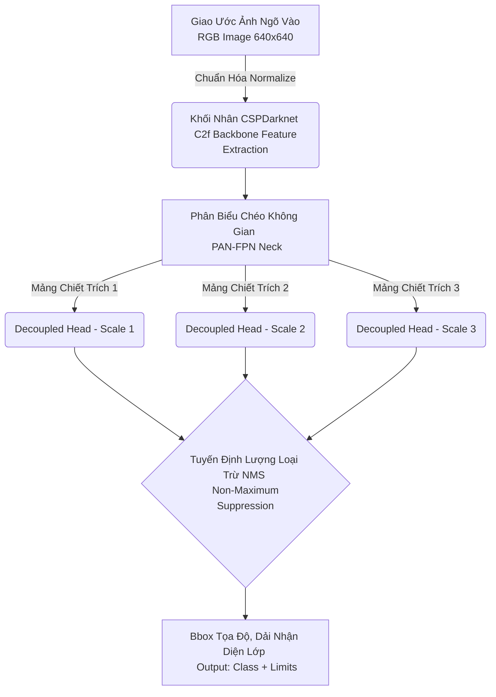

# Định Danh Hệ Tiêu Biểu: YOLOv8n (Object Detection Backbone)

Mạng Nơ-ron Đa Quy YOLOv8n (Nano) là trái tim vận hành hệ sinh thái Thị giác Không Gian nhận diện thực thể (Object Detection Module) phục vụ ứng dụng ranh giới Hỗ trợ Tiếp cận. Mô hình này được cấp quyền thông dịch trực tiếp toàn bộ chuỗi đa biến thể COCO-Accessibility, qua đó đưa ra nhận thức nhanh và chính xác nhất cho chu kỳ sống của thiết bị.

## Cấu Trúc Khối Mạng Cực Rễ (Core Architecture Anatomy)

Kế thừa phương thức siêu cấp biểu đồ (Graph evolution), kiến trúc YOLOv8n phân mảnh tinh xảo thành các phân tầng cục bộ:

- **Bộ máy Chiết xuất Vùng Tối (CSPDarknet Backbone):** Kiến trúc rút trích tinh quang đa nhánh `C2f` (Cross Stage Partial feature block) với hệ số nhân học tham số siêu nhẹ.
- **Tuyển Ghép Thông Cổ (PANet-FPN Neck Bridge):** Phức hợp mạng hòa nhập thông phân luồng hai tuyến giao (Top-down và Bottom-up spatial feature fusions) tăng cường nhận diện với đa định quy kích thước (Multi-scale object parsing).
- **Trục Đầu Phân Rã Khối (Decoupled Anchor-free Head):** Điểm chóp xé tách tuyệt đối khối Phân loại ranh lớp (Classification logic), Định vị tọa độ (Box regression regression loss) và Hệ biểu đồ đặc tính tụ góc (DFL - Distribution Focal Loss parameters). 

## Khuyếch Đại Năng Trí Học Sâu (Supervised Fine-Tuning Strategy)

Do tính phức hợp phân cảnh tại môi trường hiện thực của người dùng, dự án ứng biến công nghệ Điều chuẩn Tinh chỉnh Học Sâu thông qua:

1. **Hiệu Ứng Dung Thông (Mosaic & Mixup):** Tăng sức đề kháng (Robustness configuration) của mạng với vật thể cắt lẹm / che khuất thông qua phép biến tính ma trận ảnh (Mixup = `0.1` | Mosaic = `1.0`).
2. **Dao Động Biến Ảnh Đa Chiều (Multi-scale Training bounds):** Gieo rắc biến thiên kích thước chập ngẫu nhiên quanh lõi chuẩn tĩnh `640` trong chu kỳ Epoch, tối đa hóa năng lực trực quan hệ thống.

> CLI tĩnh `python -m src.training.scripts.yolov8n predict-errors` là bắt buộc đối với mỗi vòng lập checkpoint epoch nhằm định danh các nhãn mờ sai cực (False Negatives / Overlapped labels) dựa vào ma trận so khớp Confidence Filtering.

## Kết quả Huấn luyện Thử nghiệm (Pilot Results)

Dự án đã hoàn thành giai đoạn Pilot training cho YOLOv8n:
- **Thiết lập**: 5 epochs trên tập subset COCO.
- **Metric**: mAP@0.5 đạt **~0.19**, thiết lập baseline kỳ vọng cho các vòng lặp tiếp theo.
- **Log**: Toàn bộ quá trình được theo dõi qua TensorBoard và lưu trữ tại `runs/detect/yolov8n/pilot_5e`.

## Lượng Tử Hóa và Tối Ưu (PTQ - Dynamic)

Thay vì QAT thuần túy, YOLOv8n trong giai đoạn này sử dụng **Post-Training Dynamic Quantization** để đạt tốc độ thực thi tối đa trên CPU:

- **Công cụ**: `onnxruntime.quantization`.
- **Hiệu quả**: 
    - Mô hình gốc FP32: **~12.2 MB**.
    - Mô hình INT8 ONNX: **~3.3 MB**.
- **Tính tương thích**: Tương thích hoàn toàn với kiến trúc C2f của Ultralytics thông qua quy trình xuất ONNX tiêu chuẩn.
